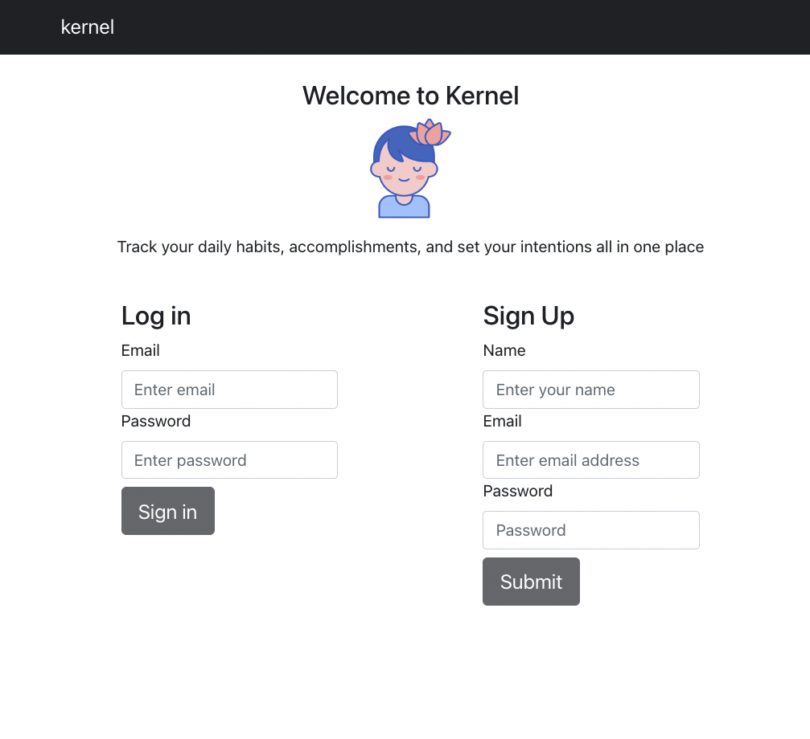
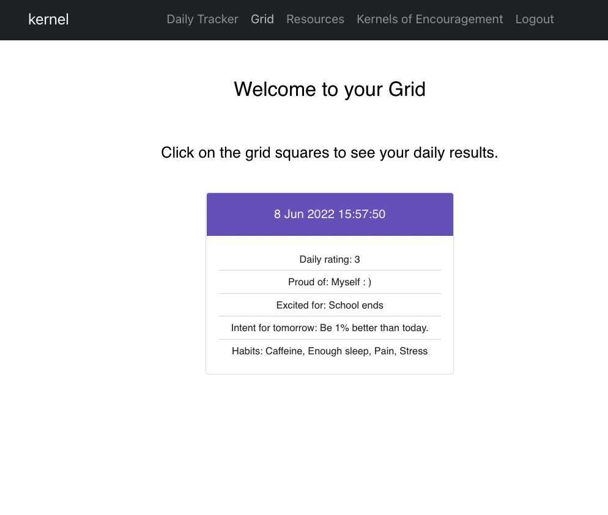

# kernel

## Description

This application is a resource/tool for users who are looking to track their personal achievements, track their habits, and set their intentions for the future.
Once signed in, the user has access to submit an entry of what they felt most proud of, what excites them in the coming week, and also set their intention for tomorrow. There are button selections on the side that allow the user to track their daily habits, ie. whether they had caffeine, exercised etc. The front end was created using React with React Bootstrap. Back end was created with node.js and utilizes a MongoDB database. 

## Features

* Track daily entries related to the users habits
* Utilize the 'Resources' tab for websites dedicated to wellness and focus
* JWT for user authentication

---

## Table of contents

* [Screenshots](#screenshots)

* [Usage](#usage)

* [Contributors](#contributors)

* [How to Contribute](#how-to-contribute)

* [References](#references)

---
## Screenshots

<!--  -->

--- 

## Usage

Once signed up and signed in, user can immediately utilize the 'Daily Tracker page where they are able to create/view posts about their day and select a rating from 1-5 of how they felt that day. Clicking on the Grid link on the navbar will show the user's past inputs. Resources has links to articles related to wellness and meditation. 

[Application deployed on Heroku]() 

## Contributors

* [Angela Donati](https://github.com/a-donati)

* [Marissa Flynn](https://github.com/ottercreektourism)

* [Andrew Maki](https://github.com/admakinh)

## How to Contribute

To help add functionality, or for debugging/refactoring the code, please contact one of our team members to request access as a collaborator.

# References 

* [JWT](https://jwt.io/)
* [Encouraging quotes API](https://type.fit/api/quotes)
* [React Bootstrap](https://react-bootstrap.github.io/)
* [Zen person icon from icons8.com](https://icons8.com/icons/set/calm)

